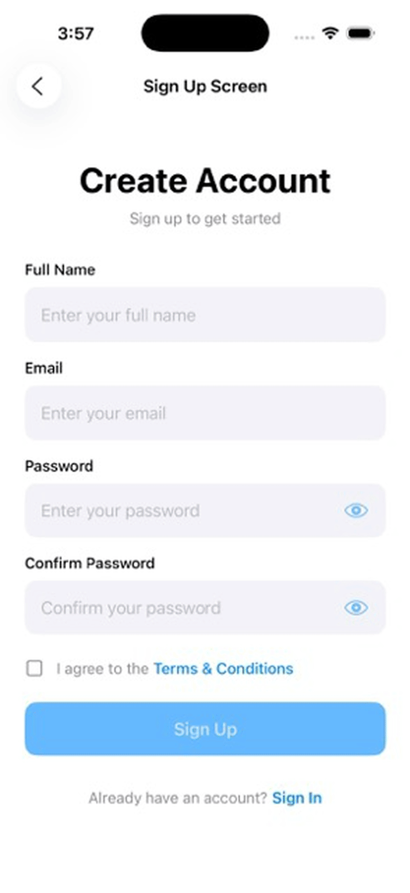

# ChrisUI

A comprehensive SwiftUI component library designed to accelerate iOS app development with production-ready, customizable components.


## Overview

ChrisUI provides a rich collection of 50+ reusable SwiftUI components that follow Apple's Human Interface Guidelines and modern SwiftUI best practices. Each component is fully documented, accessible, and supports both light and dark modes.  This is a library, so each of the components are meant to be copied to your project directly for customization.  This is not a framework that you import into your project.



## Features

- 🎨 **50+ Production-Ready Components** across 13 categories
- 📱 **iOS 16+ Support** with modern SwiftUI features
- ♿️ **Accessibility First** - Full Dynamic Type and VoiceOver support
- 🌓 **Dark Mode Ready** - All components work seamlessly in both themes
- 📚 **Comprehensive Documentation** - Every component fully documented with examples
- 🎯 **Type-Safe Navigation** - Modern NavigationStack with path-based routing
- 🧪 **Live Demos** - Interactive demo app showcasing all components

## Component Categories

### Authentication & Onboarding
- Login Screen with validation
- Sign Up Form with password confirmation
- Social Auth Buttons (Apple, Google, Facebook)

### Forms & Input
- Custom Text Fields with validation
- Floating Label Text Fields (Material Design style)
- Form validation utilities

### Lists & Collections
- Pull to Refresh List
- Infinite Scroll List with pagination
- Swipeable List Rows with actions
- Expandable Accordion Lists
- Responsive Grid Layouts
- Horizontal Scroll Pickers
- Reorderable Drag-and-Drop Lists
- Empty State Views

### Cards & Containers
- Card Views with customizable styling
- Profile Cards (basic and extended)
- Multiple shadow and border options

### Buttons & Actions
- Gradient Buttons with animations
- Icon Buttons (circular)
- Loading Buttons with async support
- Custom Button Styles (Scale, Fade, Pressable)

### Charts & Visualizations
- Line Charts for time series data
- Bar Charts for comparisons
- Pie Charts with interactive selection
- Donut Charts with center displays
- Progress Rings with animations
- Sparklines for compact trends
- Gauge Views (speedometer style)
- Heat Maps for intensity data

### E-commerce
- Product Grids
- Add to Cart Buttons with animations
- Quantity Selectors (3 style variations)
- Price Tags with formatting
- Discount Badges
- Size Selectors
- Color Swatches
- Checkout Progress Indicators
- Order Status Tracking

### Effects & Utilities
- Shimmer Loading Effects
- Custom Button Styles
- Validation helpers
- Extensions and utilities

## Requirements

- iOS 16.0+
- Xcode 15.0+
- Swift 5.9+

## Quick Start

### Basic Usage

```swift
import SwiftUI

struct ContentView: View {
    @State private var email = ""
    @State private var password = ""

    var body: some View {
        VStack(spacing: 20) {
            CustomTextField(
                title: "Email",
                placeholder: "Enter your email",
                text: $email,
                keyboardType: .emailAddress,
                leadingIcon: "envelope"
            )

            CustomTextField(
                title: "Password",
                placeholder: "Enter your password",
                text: $password,
                isSecure: true,
                showVisibilityToggle: true,
                leadingIcon: "lock"
            )

            GradientButton(
                title: "Sign In",
                action: { print("Sign in tapped") }
            )
        }
        .padding()
    }
}
```

### Using with ViewModels

```swift
import SwiftUI

struct LoginView: View {
    @State private var viewModel = LoginViewModel()

    var body: some View {
        LoginScreen(viewModel)
    }
}
```

### Charts Example

```swift
import SwiftUI

struct AnalyticsView: View {
    let data = [
        ChartDataPoint(label: "Jan", value: 42),
        ChartDataPoint(label: "Feb", value: 58),
        ChartDataPoint(label: "Mar", value: 65)
    ]

    var body: some View {
        VStack {
            LineChart(
                data: data,
                title: "Monthly Revenue",
                lineColor: .blue
            )
            .frame(height: 200)

            ProgressRing(
                progress: 0.75,
                lineWidth: 12,
                ringColor: .green
            )
            .frame(width: 100, height: 100)
        }
    }
}
```

### E-commerce Example

```swift
import SwiftUI

struct ProductView: View {
    @State private var quantity = 1
    @State private var selectedSize = "M"

    var body: some View {
        VStack(spacing: 16) {
            PriceTag(
                price: 49.99,
                originalPrice: 79.99,
                currency: "$"
            )

            SizeSelector(
                sizes: ["XS", "S", "M", "L", "XL"],
                selectedSize: $selectedSize
            )

            QuantitySelector(
                quantity: $quantity,
                style: .rounded
            )

            AddToCartButton(
                title: "Add to Cart",
                onAdd: { print("Added to cart") }
            )
        }
        .padding()
    }
}
```

## Architecture

### Component Structure

Each component follows a consistent architecture:

```swift
/// Brief description of the component
///
/// Detailed explanation of what it does and when to use it.
///
/// Example:
/// ```swift
/// CustomComponent(
///     title: "Example",
///     action: { print("Tapped") }
/// )
/// ```
public struct CustomComponent: View {
    // Properties
    private let title: String
    private let action: () -> Void

    // Initialization
    public init(
        title: String,
        action: @escaping () -> Void
    ) {
        self.title = title
        self.action = action
    }

    // Body with subviews as computed properties
    public var body: some View {
        VStack {
            headerView
            contentView
        }
    }

    private var headerView: some View {
        Text(title)
    }

    private var contentView: some View {
        Button("Action", action: action)
    }
}
```

### ViewModels

Components with complex state use `@Observable` ViewModels:

```swift
@Observable
public class CustomViewModel {
    var title: String = "Default"
    var isLoading: Bool = false

    func performAction() async {
        isLoading = true
        // Perform async work
        isLoading = false
    }
}
```

### Navigation

The demo app uses type-safe navigation with `NavigationStack`:

```swift
enum Route: Hashable {
    case loginScreen
    case signUpScreen
    // ... other routes

    var title: String {
        switch self {
        case .loginScreen: return "Login Screen"
        case .signUpScreen: return "Sign Up Screen"
        }
    }
}
```

## Demo App

The included demo app showcases all components with interactive examples:

1. Clone the repository
2. Open `ChrisUI.xcodeproj` in Xcode
3. Run the app on the simulator or device
4. Browse components by category
5. Interact with live demos

## Customization

All components support extensive customization:

```swift
// Buttons
GradientButton(
    title: "Custom",
    gradient: Gradient(colors: [.orange, .pink]),
    icon: "star.fill",
    cornerRadius: 16,
    action: { }
)

// Cards
CardView(
    backgroundColor: .blue.opacity(0.1),
    borderColor: .blue,
    borderWidth: 2,
    shadowRadius: 8
) {
    // Your content
}

// Charts
BarChart(
    data: data,
    title: "Sales",
    barColor: .green,
    showGrid: true,
    animated: true
)
```

## Accessibility

All components include:

- ✅ VoiceOver support with descriptive labels
- ✅ Dynamic Type support for text scaling
- ✅ High contrast mode compatibility
- ✅ Keyboard navigation support
- ✅ Semantic content attributes

## Best Practices

### Validation

Use built-in validators for form inputs:

```swift
let emailValidation = Validator.validateEmail(email)
if emailValidation.isValid {
    // Proceed with login
} else {
    // Show error: emailValidation.message
}
```

### Async Operations

Use async/await with ViewModels:

```swift
Button("Submit") {
    Task {
        await viewModel.submit()
    }
}
```

### Performance

Components use lazy loading and efficient rendering:

```swift
InfiniteScrollList(
    items: items,
    loadThreshold: 5,
    onLoadMore: { await loadMoreItems() }
) { item in
    ItemRow(item: item)
}
```

## Contributing

Contributions are welcome! Please follow these guidelines:

1. Create a new component under the appropriate category in `Sources/Components/`
2. Add comprehensive documentation with triple-slash comments
3. Include usage examples in the documentation
4. Create a demo view in the `Demo/` folder
5. Update the navigation routes
6. Ensure accessibility support
7. Test in both light and dark modes
8. Follow the existing code style and architecture

## Roadmap

- [x] Phase 1: Foundation (Authentication, Forms, Buttons, Cards)
- [x] Phase 2: Enhanced Features (Lists, Charts, E-commerce)
- [x] Phase 3: Polish (Documentation, Demos, Navigation)

## License

[To be determined]

## Author

Chris Shireman

## Acknowledgments

Built with SwiftUI and following Apple's Human Interface Guidelines.

---

**Note**: This library is under active development. APIs may change between versions.
